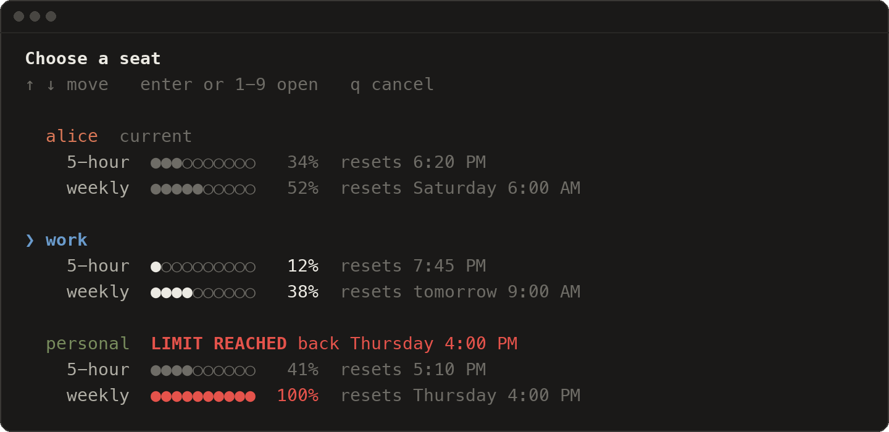

<p align="center"><picture><source media="(prefers-color-scheme: dark)" srcset="docs/assets/logo/logo-dark.png"></picture></p>

<p align="center">
  <a href="https://github.com/garzario/ccseat/actions/workflows/ci.yml"></a>
  <a href="https://github.com/garzario/ccseat/releases"></a>
  <a href="LICENSE"></a>
  
</p>

<p align="center">
  <a href="https://github.com/garzario/ccseat/issues/new?template=bug_report.yml">Report a bug</a>
  &nbsp;·&nbsp;
  <a href="https://github.com/garzario/ccseat/issues/new?template=feature_request.yml">Request a feature</a>
  &nbsp;·&nbsp;
  <a href="https://github.com/garzario/ccseat/discussions">Ask a question</a>
</p>

<p align="center"><b>Use all your Claude Code accounts side by side.</b><br>
Pick one with the arrow keys, see every account's usage, and let <code>claude</code> move to a free account when one hits its limit.</p>

<p align="center">
  
</p>

Each of your accounts becomes a **seat**: its own login and its own usage limits, with one shared setup. Settings, `CLAUDE.md`, skills, agents, commands, hooks, plugins and conversations are the same in every seat, so you never log out and in again and `claude --resume` works from any of them.

## Quick start

1. **Install**, then open a new terminal. Your current Claude Code login becomes your first seat.

   ```sh
   curl -fsSL https://raw.githubusercontent.com/garzario/ccseat/main/install.sh | bash
   ```

2. **Add each of your other accounts.** Your browser opens: sign in with the account you want to add. The seat is named after the email, so `work@example.com` becomes `work`.

   ```sh
   ccseat add
   ```

3. **Just type `claude`** as always, or `cc` to pick a seat. `claude` opens your current seat, and when that seat is at its 5-hour or weekly limit it opens the freest one instead:

   ```text
   $ claude
   ccseat: alice is at its 5-hour limit until 6:20 PM, using work
   ```

## Everyday use

| Command | What it does |
|---|---|
| `claude` | Opens Claude Code in your current seat, and moves to the freest seat when that one is at its limit |
| `cc` | Opens the seat picker. With arguments it is still your C compiler: `cc -o hello hello.c` works as before |
| `ccseat list` | Every seat with its 5-hour and weekly usage, reset times and status |
| `ccseat add` | Signs in to another account and adds it as a seat |
| `ccseat run work` | Opens Claude Code with one seat; anything after the seat goes to `claude` |
| `ccseat statusline install` | Shows the seat and its usage under the Claude Code prompt |

**`claude`** opens Claude Code in your current seat, with every argument passed along (`claude --resume`, `claude -p "..."`). When that seat is at its limit, it opens the freest seat instead and says so in one line. Your current seat stays the same, so `claude` goes back to it once it resets.

**`cc`** opens the picker shown above: every seat with its usage bars, the cursor on the freest one. Press `Enter` or a seat's number to open it. `cc` is short for `ccseat`, and it only takes over `cc` with no arguments: `cc` with arguments runs your C compiler exactly as before. Prefer another name? `ccseat config shortcut cs` (or `off` for none).

**`ccseat list`** prints the same numbers as a table, one row per seat, with a status column. It works in scripts too: `ccseat list --json`.

**The status line** keeps the seat and its usage in sight while you work:

<p align="center">
  
</p>

- **Row 1:** the seat in its color, the model and effort, the folder and git branch (`*` when there are uncommitted changes), and how full the context is.
- **Rows 2 and 3:** 5-hour and weekly usage, with the time each resets. From 85% the row says `almost out`; at the limit it turns red and says `LIMIT REACHED until <time>`; and when another seat has room it adds `next:` with that seat's name.
- **A `running` row** appears while a workflow or background agents run in the session.

Install it once with `ccseat statusline install`; every seat shares it. Claude Code does not tell a status line how wide the terminal is, so it fits into 80 columns. On a wide terminal, raise that with `ccseat config statusline_width 120` (or set `COLUMNS`), so the next seat is named in full instead of as `seat 2`.

**LIMIT REACHED** means a seat is out for now: its 5-hour usage is at `limit_5h` (95% by default) or its weekly usage is at `limit_weekly` (100%). The picker shows it in bold red next to the seat's name with the time it comes back, `ccseat list` says `limit reached until <time>`, and the status line says `LIMIT REACHED until <time>`. `claude` moves on to another seat by itself. Opening an out seat on purpose still works: the picker asks first, and `ccseat run` prints a one-line warning.

Every command is in the [command reference](docs/commands.md), and `ccseat help <command>` prints a command's help in your terminal.

## Install

**Requirements:** macOS or Linux, bash (the `/bin/bash` 3.2 that macOS ships is fine), `jq`, `curl` and [Claude Code](https://github.com/anthropics/claude-code).

**One line** (recommended). It installs the latest release into `~/.local`, checks it against the release's published checksum, never uses `sudo`, and asks before it adds one marked block to your shell startup file:

```sh
curl -fsSL https://raw.githubusercontent.com/garzario/ccseat/main/install.sh | bash
```

**Homebrew:**

```sh
brew tap garzario/ccseat https://github.com/garzario/ccseat
brew install ccseat
ccseat setup        # adds the shell integration (asks first)
```

**From a clone** (a `git pull` updates it):

```sh
git clone https://github.com/garzario/ccseat
cd ccseat
./install.sh
```

Installer options (such as `--ref main` for the development version), `make install`, updating and uninstalling are in [docs/installation.md](docs/installation.md).

## Is it safe?

ccseat is plain bash, so everything it does is in the open. In plain words:

- **It runs on your computer only.** The one request it makes on its own is to Anthropic's usage endpoint (`api.anthropic.com`), to ask how much of each account's limit is left. There is no server of ours and no telemetry.
- **It reads the login Claude Code already stored** (in the macOS Keychain, or in `.credentials.json` on Linux) only to ask that question. It never prints, logs or saves a token, never puts one on a command line, and never writes to the Keychain. Signing in and out is always done by Claude Code itself.
- **It never deletes your data.** A removed seat goes to the Trash, and a file it replaces is kept in a backup first. The only files it removes outright are its own, and empty files or exact copies that a shared link replaces.
- **It is easy to undo.** `ccseat uninstall` takes out the shell lines and the status line it added and puts back the status line you had. Your seats and `~/.claude` stay.
- **It is for your own accounts.** Each account keeps its own limits, and every seat is an ordinary Claude Code login. Use it only with accounts that are yours, follow Anthropic's terms for each one, and never share an account or a login.

The details are in [How it works](docs/how-it-works.md) and in the [security policy](.github/SECURITY.md).

## Documentation

- [Installation](docs/installation.md): every way to install, update and uninstall
- [Usage](docs/usage.md): seats, `claude`, the `cc` picker, `ccseat list`, the status line and limits
- [Commands](docs/commands.md): every command and option
- [Configuration](docs/configuration.md): settings, environment variables and files
- [How it works](docs/how-it-works.md): what is shared, where logins live, where usage comes from
- [FAQ](docs/faq.md): common questions
- [Troubleshooting](docs/troubleshooting.md): when something looks wrong
- [Development](docs/development.md): the code layout, tests, and releasing

## Contributing

Found a bug? [Report it](https://github.com/garzario/ccseat/issues/new?template=bug_report.yml): only one box is required. Ideas go in a [feature request](https://github.com/garzario/ccseat/issues/new?template=feature_request.yml), and questions in [Discussions](https://github.com/garzario/ccseat/discussions). Pull requests are welcome: read the [contributing guide](.github/CONTRIBUTING.md) first, and report security problems privately as the [security policy](.github/SECURITY.md) describes.

## License

[MIT](LICENSE), copyright 2026 Patricio Garza.

ccseat is an independent project. It is not affiliated with or endorsed by Anthropic.
