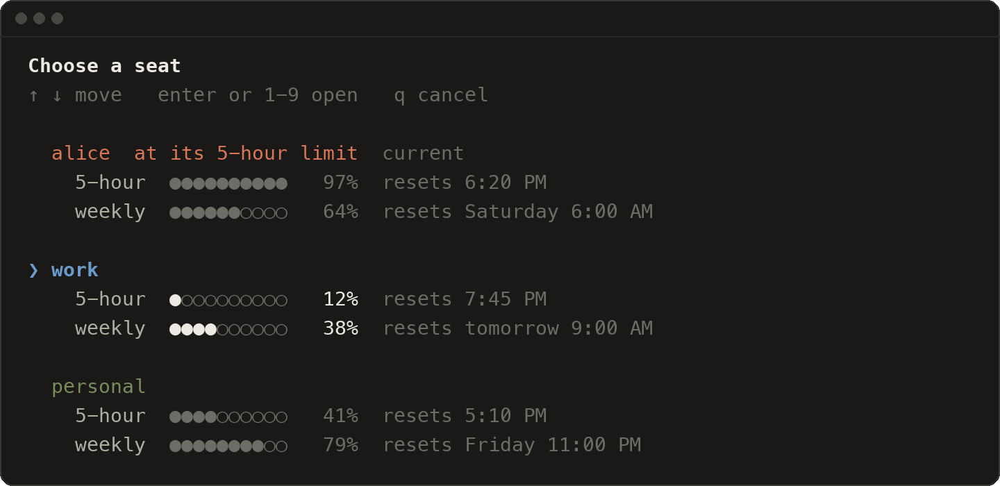
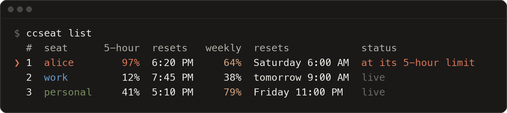
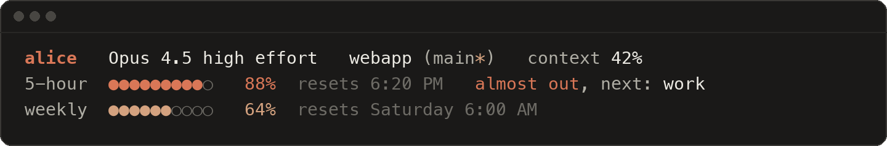

# ccseat

**Use all your Claude Code accounts side by side.** See every account's usage, pick one with the arrow keys, and never log out and in again. When the account you are on hits its 5-hour or weekly limit, `claude` opens the freest one instead.

<p align="center">
  
</p>

```sh
curl -fsSL https://raw.githubusercontent.com/garzario/ccseat/main/install.sh | bash
```

- **Add as many accounts as you have.** `ccseat add` signs in to another account and names the seat after its email: `bob@example.com` becomes `bob`.
- **One setup for all of them.** Every seat shares your settings, `CLAUDE.md`, skills, agents, commands, hooks, plugins and conversations, so `claude --resume` works from any seat. Only the login and the usage limits are separate.
- **Keep typing `claude`.** It opens your current seat and moves to a free one when that seat is at its limit, with a one-line notice.
- **Usage at a glance.** In the picker, in `ccseat list`, and in Claude Code's status line.
- **Careful with your data.** Logins stay where Claude Code keeps them, tokens are never printed or saved, and removed seats go to the Trash instead of being deleted.

[Install](#install) · [Quick start](#quick-start) · [Picking a seat](#picking-a-seat) · [Auto-switch](#auto-switch) · [Status line](#status-line) · [Commands](#commands) · [Configuration](#configuration) · [How it works](#how-it-works) · [FAQ](#faq)

## Install

```sh
curl -fsSL https://raw.githubusercontent.com/garzario/ccseat/main/install.sh | bash
```

Then open a new terminal. The installer:

- downloads ccseat into `~/.local/share/ccseat/app` and links `~/.local/bin/ccseat` (it never uses `sudo`),
- checks for `jq`, `curl` and Claude Code, and prints the exact install command for anything missing,
- asks before adding one marked block to your shell startup file (`~/.zshrc`, `~/.bash_profile` on macOS, `~/.bashrc` on Linux, or `~/.config/fish/conf.d/ccseat.fish`), so that `claude` goes through ccseat and `~/.local/bin` is on your `PATH`.

**Requirements:** macOS or Linux, bash (the `/bin/bash` 3.2 that macOS ships is fine), `jq`, `curl` and [Claude Code](https://github.com/anthropics/claude-code).

If you skip the shell step, `ccseat setup` adds it later (the installer prints the exact command). Installer options go after `bash -s --`:

```sh
curl -fsSL https://raw.githubusercontent.com/garzario/ccseat/main/install.sh | bash -s -- --no-shell
```

| Option | What it does |
|---|---|
| `-y`, `--yes` | add the shell block without asking |
| `--no-shell` | leave your shell startup files alone |
| `--shell zsh\|bash\|fish` | set up that shell instead of the one in `$SHELL` |
| `--prefix DIR` | link the command into `DIR/bin` (default `~/.local`) |
| `--ref REF` | install a branch, tag or commit (default `main`) |
| `--uninstall` | remove what the installer added; your seats stay |

### Homebrew

Coming soon, with the first tagged release.

### From a clone

```sh
git clone https://github.com/garzario/ccseat
cd ccseat
./install.sh        # links this clone, so a git pull updates ccseat
```

Or copy it into a prefix with `make`, then add the shell integration:

```sh
make install PREFIX="$HOME/.local"   # or: sudo make install (into /usr/local)
~/.local/bin/ccseat setup            # also puts ~/.local/bin on your PATH if needed
```

## Quick start

1. **Install** with the line above and open a new terminal. Your current Claude Code login (`~/.claude`) becomes your first seat, named after its email. If you have never signed in, the first `ccseat add` signs in to `~/.claude` itself.
2. **Add each of your other accounts** with `ccseat add`. Your browser opens: sign in with the account you want to add.
3. **Open Claude Code.** Run `ccseat` to pick a seat, or just type `claude` as always.

```text
$ ccseat add
Signing in to Claude Code for the new seat.
Your browser opens. If it is signed in to a Claude account you already
added, switch accounts there first, or open the link Claude Code prints
in a private window.

Added work (work@example.com).
Open it with: ccseat run work
```

### Seat names

- A seat is named after the part of its email before the `@`, in lowercase: `alice@example.com` is `alice`, and `Bob.Smith@corp.example` is `bob.smith`.
- A second `alice` (say `alice@work.example`) becomes `alice-2`. Choose the name yourself with `ccseat add --name client`, or later with `ccseat rename alice-2 alice-work`.
- `ccseat add bob@example.com` fills in that email on the login page.
- Wherever a command takes a seat, you can type its name, the start of its name, its number in `ccseat list`, its email or its folder: `ccseat run 2`, `ccseat run wo`.

Already keep accounts in separate folders, like `CLAUDE_CONFIG_DIR=~/.claude-work claude`? Add them without signing in again:

```sh
ccseat add --dir ~/.claude-work
```

ccseat looks for logged-in `~/.claude-*` folders and suggests that line on its first run, in `ccseat list` and in `ccseat doctor`.

## Picking a seat

`ccseat` (or `cs` for short) opens the picker shown at the top. It starts on the freest seat.

| Key | Action |
|---|---|
| `↑` `↓` or `k` `j` | move |
| `Enter` | open the selected seat |
| `1` to `9` | open that seat right away |
| `q`, `Esc` or `Ctrl-C` | cancel |

The seat you open becomes the current seat (turn that off with `ccseat config remember off`). In a small terminal the picker shows one line per seat.

`ccseat list` shows the same numbers as a table, and `ccseat list --json` gives them to scripts:

<p align="center">
  
</p>

The status column says `live`, how old the numbers are (`3 min ago`), `at its 5-hour limit` or `at its weekly limit`, `offline`, `not logged in`, `idle` (the login expired while the seat was unused; Claude Code renews it the next time the seat opens) or `usage unavailable` (the usage API refused the login; open the seat once).

`ccseat usage` draws the bars for one seat (the current one unless you name another; `--all` for every seat, `--refresh` to fetch now). When Anthropic reports a weekly limit for a single model, such as Opus, it shows that too.

To open a particular seat:

```sh
ccseat run work              # or just: ccseat work
ccseat run 2 --resume        # anything after the seat goes to claude
ccseat use personal          # make it the current seat without opening it
```

## Auto-switch

With the shell integration, `claude` goes through ccseat:

```text
$ claude
ccseat: alice is at its 5-hour limit until 6:20 PM, using work
```

- `claude` opens your current seat. If that seat is at its limit (5-hour usage at 95% or more, or weekly usage at 100%; see `limit_5h` and `limit_weekly`), it opens the freest logged-in seat instead and prints that one line.
- If every seat is at a limit, it opens the one that frees up first.
- The current seat does not change, so once alice resets, `claude` opens alice again.
- It never waits more than about 1.5 seconds for usage numbers. Other seats refresh in the background.
- Every argument passes through: `claude --resume`, `claude -p "summarize the README"`. Subcommands that do not start a session, like `claude mcp`, `claude auth` and `claude update`, go straight to the current seat.
- `claude mcp add --scope user` (also `add-json` and `remove`) changes `~/.claude` and copies the change to every seat.
- A `CLAUDE_CONFIG_DIR` you set yourself wins: a seat's folder opens that seat, and any other folder opens exactly as asked. Aliases like `CLAUDE_CONFIG_DIR=~/.claude-work claude` keep working.
- `ccseat run` and the picker never switch: they open the seat you chose.

Turn switching off with `ccseat config auto_switch off`. To skip ccseat for one command, run `command claude`, or set `CCSEAT_NO_WRAP=1`.

The shell integration is one line in your startup file, which the installer and `ccseat setup` add for you:

```sh
eval "$(ccseat init zsh)"     # in ~/.zshrc (bash: eval "$(ccseat init bash)")
ccseat init fish | source     # in fish
```

It defines the `claude` function (in interactive shells only), `cs` as a short name for `ccseat` (unless you already have a `cs`), and tab completion for commands and seat names.

## Status line

<p align="center">
  
</p>

```sh
ccseat statusline install
```

Under the Claude Code prompt it shows:

- the seat in its color, the model and effort, the folder and git branch (`*` when there are uncommitted changes), and how full the context is,
- 5-hour and weekly usage with reset times. From 85%, or at the limit, the row says so and, when another seat has room, names the freest one,
- a `running` row while a workflow or background agents run in the session (see `ccseat progress`).

`install` sets the `statusLine` entry of `~/.claude/settings.json`, which every seat shares, after saving a copy in `~/.config/ccseat/backups`. A status line you already had is kept aside, and `ccseat statusline uninstall` puts it back. Run `ccseat statusline` in a terminal for a preview. The status line also saves the usage Claude Code reports into ccseat's cache, which keeps `ccseat list` fresh.

## Commands

| Command | What it does |
|---|---|
| `claude [args]` | Claude Code in the current seat, switching at a limit (needs the shell integration) |
| `ccseat` | Pick a seat with the arrow keys and open it (prints the list when not in a terminal) |
| `ccseat run <seat> [args]` | Open Claude Code with a seat; `ccseat <seat>` is short for it |
| `ccseat list [--json]` | Every seat with its usage, reset times and status |
| `ccseat usage [seat] [--all] [--refresh] [--json]` | Usage bars for a seat, the current one by default |
| `ccseat add [email] [--name N] [--dir D]` | Sign in to another account and add it as a seat |
| `ccseat use <seat>` | Make a seat the current one without opening it |
| `ccseat current [--dir]` | Print the current seat, or its folder |
| `ccseat rename <seat> <new>` | Rename a seat; its folder and login stay |
| `ccseat remove <seat> [--keep-files] [-y]` | Sign a seat out and move its folder to the Trash (never `~/.claude`) |
| `ccseat sync [seat]` | Repair the shared links and copy MCP servers and trusted folders from `~/.claude` |
| `ccseat setup [zsh\|bash\|fish]` | Add the shell integration to your startup file and offer the status line |
| `ccseat init zsh\|bash\|fish` | Print the shell integration |
| `ccseat statusline install\|uninstall` | Turn the status line on or off (`--seat S` for a seat with its own settings) |
| `ccseat progress [--line\|--tsv\|--agents]` | Workflows and agents running in a Claude Code session |
| `ccseat doctor` | Check the tools, seats, shell integration and status line, and print fixes |
| `ccseat config [key [value]]` | Read or change settings |
| `ccseat uninstall [--purge] [-y]` | Remove ccseat; seats stay unless `--purge` |
| `ccseat help [command]` | Help for ccseat or for one command |
| `ccseat version` | Print the version |

`ls`, `rm`, `mv` and `switch` also work for `list`, `remove`, `rename` and `use`. Exit codes: 0 done, 1 error, 2 wrong usage, 130 cancelled.

## Configuration

`ccseat config` prints every setting, `ccseat config <setting> <value>` changes one, and the value `default` puts the default back.

| Setting | Default | What it does |
|---|---|---|
| `auto_switch` | `on` | `claude` opens the freest seat when the current one is at its limit |
| `limit_5h` | `95` | 5-hour usage, in percent, that counts as the limit |
| `limit_weekly` | `100` | weekly usage, in percent, that counts as the limit |
| `remember` | `on` | the seat you open from the picker becomes the current seat |
| `share` | 14 items | what every seat shares with `~/.claude`, separated by commas |
| `colors` | `auto` | `auto`, `always` or `never`; `auto` follows the terminal and `NO_COLOR` |
| `statusline_width` | `80` | columns the status line fits into; Claude Code does not tell it the terminal width, so raise it on a wide terminal to see the full name of the seat to switch to |

```sh
ccseat config limit_5h 90
ccseat config share default
```

Environment variables:

| Variable | Effect |
|---|---|
| `CCSEAT_NO_WRAP=1` | the `claude` function runs Claude Code directly |
| `CCSEAT_HOME` | where ccseat keeps its settings (default `~/.config/ccseat`) |
| `NO_COLOR` | no colors |
| `COLUMNS` | when set, the status line fits into this width instead of `statusline_width` |
| `XDG_CONFIG_HOME`, `XDG_DATA_HOME`, `XDG_CACHE_HOME` | respected for settings, seat folders and cache |

## How it works

Claude Code keeps its login, settings and history in one config folder, `~/.claude` by default, and uses another folder when `CLAUDE_CONFIG_DIR` points to it. A seat is one such folder with its own login.

- **The primary seat** is your existing `~/.claude`. ccseat opens it with `CLAUDE_CONFIG_DIR` unset, exactly like plain `claude`. It is never removed.
- **Other seats** are private folders in `~/.local/share/ccseat/seats/`, opened with `CLAUDE_CONFIG_DIR` set to them.
- **Shared through symlinks** into `~/.claude`: `settings.json`, `CLAUDE.md`, `skills`, `agents`, `commands`, `rules`, `hooks`, `output-styles`, `plugins`, `projects` (conversations and project memory), `file-history`, `plans`, `todos`, `history.jsonl` (prompt history), and status line scripts your settings run from `~/.claude`. Missing targets are created, so every link is valid.
- **Never shared:** the login, `.claude.json`, sessions, caches, telemetry and IDE state.
- **Copied instead of linked:** each seat has its own `.claude.json`, so ccseat copies the MCP servers and trusted folders from `~/.claude.json` into it, plus the onboarding flag, so a new seat skips first-run setup. This runs silently every time a seat opens (`ccseat sync` does it by hand). MCP servers a seat added on its own stay.
- **Adopting a folder** with `--dir` loses nothing: skills, conversations and other entries that `~/.claude` lacks are copied into it, and the folder's own copies of shared items, such as its `settings.json`, move to `.ccseat-backup/` inside the seat.
- **Logins** stay where Claude Code puts them. On macOS that is the Keychain, as `Claude Code-credentials` for `~/.claude` and `Claude Code-credentials-<8 hex characters>` (from a SHA-256 of the folder path) for other seats; on Linux it is `<seat folder>/.credentials.json`. ccseat only reads them. Signing in and out is always done by Claude Code (`claude auth login`, `claude auth logout`).
- **Usage** comes from `https://api.anthropic.com/api/oauth/usage`, asked with each seat's own login. **This endpoint is not documented and may change at any time.** If it does, seats still open, but ccseat shows no usage and cannot switch at a limit. The token goes to `curl` on stdin, never on a command line, and is never printed, logged or saved. Answers are kept in private files in `~/.cache/ccseat` and fetched again when they are more than a minute old.
- **ccseat's own files** are in `~/.config/ccseat`: `seats` (one `name<TAB>folder` line per seat), `current`, `config` and `backups/`.

See [SECURITY.md](SECURITY.md) for how credentials are handled.

## FAQ

**Is this allowed?**
ccseat is for people who have more than one Claude account of their own, for example a personal plan and a work plan. It does not get around any limit: each account keeps its own 5-hour and weekly limits, and every seat is an ordinary Claude Code login made by `claude auth login`. Use it only with accounts that are yours, follow Anthropic's terms for each of them, and never share an account or a login with anyone else.

**Does it work on Linux?**
Yes. It needs bash, `jq` and `curl`, as on macOS. Logins are read from each seat's `.credentials.json`, and removed seats go to `~/.local/share/Trash`, where your file manager can restore them. CI runs the test suite on Ubuntu and macOS.

**Can I keep a seat isolated?**
What is shared is the same for every seat. To share less, shorten the list; ccseat removes the links it made for the rest, and `ccseat config share default` brings them back:

```sh
ccseat config share settings.json,CLAUDE.md,skills
```

To give one seat its own copy of one item, point that seat's link somewhere else. ccseat keeps a link you point elsewhere:

```sh
dir=$(ccseat usage work --json | jq -r .dir)   # the seat's folder
ln -sfn ~/notes/work-CLAUDE.md "$dir/CLAUDE.md"
```

For an account that shares nothing at all, do not add it as a seat and open it yourself with `CLAUDE_CONFIG_DIR=~/claude-private claude`. ccseat opens folders it does not know exactly as asked.

**Is there a limit on how many accounts I can add?**
No. Add one seat per account. When they do not fit in the terminal, the picker shows one line per seat and scrolls; the number keys open the first nine, and every seat can be reached with the arrow keys or opened by name.

**Can I continue a conversation on another account?**
Yes. Conversations are shared, so `claude --resume` (or `ccseat run work --resume`) in the same folder lists the sessions of every seat.

**Do editors and scripts use ccseat?**
Only commands that go through the `claude` shell function or `ccseat` do. Editor extensions and scripts that start Claude Code by themselves keep using `~/.claude`, or whatever `CLAUDE_CONFIG_DIR` they are given.

**The browser signed in with the wrong account.**
The login happens in your browser, so a browser already signed in to claude.ai may pick that account. If it is an account you already added, ccseat signs that login out again and adds nothing. Sign out of claude.ai in the browser, or open the link Claude Code prints in a private window, and run `ccseat add` again.

**Something looks wrong.**
Run `ccseat doctor`. It checks the tools, every seat's login and links, the shell integration and the status line, and prints the fix for each problem.

**How do I uninstall?**

```sh
ccseat uninstall            # the shell integration, the status line and the program; seats stay
ccseat uninstall --purge    # also signs out every seat except ~/.claude and moves their folders
                            # and ccseat's settings to the Trash
```

Your `~/.claude` folder and its login always stay. If the `ccseat` command is already gone, the installer can clean up what it added:

```sh
curl -fsSL https://raw.githubusercontent.com/garzario/ccseat/main/install.sh | bash -s -- --uninstall
```

## Contributing

Issues and pull requests are welcome. ccseat is plain bash that runs on the bash 3.2 of macOS and on bash 5.

```sh
make test    # the test suite, in a sandbox HOME with stubbed claude, curl and Keychain
make lint    # shellcheck on every script
make check   # both
```

The tests never touch your real `~/.claude`, your Keychain or the network. Read [CONTRIBUTING.md](CONTRIBUTING.md) before opening a pull request, and report security issues privately as described in [SECURITY.md](SECURITY.md).

## License

[MIT](LICENSE), copyright 2026 Patricio Garza.

ccseat is an independent project. It is not affiliated with or endorsed by Anthropic.
