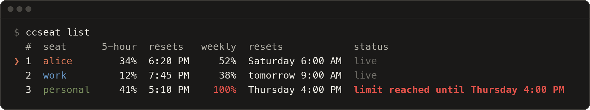

# Usage

This page walks through a normal day with ccseat. Every command it mentions is in the [command reference](commands.md).

- [Seats](#seats)
- [Adding accounts](#adding-accounts)
- [The three commands you use most](#the-three-commands-you-use-most)
- [Picking a seat](#picking-a-seat)
- [Usage at a glance](#usage-at-a-glance)
- [Opening a particular seat](#opening-a-particular-seat)
- [Auto-switch](#auto-switch)
- [When a seat is out: LIMIT REACHED](#when-a-seat-is-out-limit-reached)
- [Status line](#status-line)
- [Workflow and agent progress](#workflow-and-agent-progress)

## Seats

A **seat** is one Claude Code account on your computer: its own login and its own 5-hour and weekly limits. Everything else is shared, so every seat has the same settings, `CLAUDE.md`, skills, agents, commands, hooks, plugins and conversations. [How it works](how-it-works.md) explains exactly what is shared.

- Your existing `~/.claude` folder is the **primary seat**. The first time ccseat runs and finds you signed in there, that login becomes a seat, named after its email.
- The **current seat** is the one `claude` and the status line use. `ccseat use <seat>` changes it, and so does opening a seat from the picker.

## Adding accounts

```text
$ ccseat add
Signing in to Claude Code for the new seat.
Your browser opens. If it is signed in to a Claude account you already
added, switch accounts there first, or open the link Claude Code prints
in a private window.

Added work (work@example.com).
Open it with: ccseat run work
```

Run `ccseat add` once for each extra account. Claude Code's own sign-in runs in between (`claude auth login`), and your browser opens: sign in with the account you want to add. If the browser signs in to an account you already added, ccseat signs that login out again and adds nothing.

If you have never signed in to Claude Code at all, the first `ccseat add` signs in to `~/.claude` itself, so plain `claude` and your editor use that account too.

### Seat names

- A seat is named after the part of its email before the `@`, in lowercase: `alice@example.com` is `alice`, and `Bob.Smith@example.com` is `bob.smith`.
- A second `alice` (say `alice@work.example`) becomes `alice-2`. Choose the name yourself with `ccseat add --name client`, or later with `ccseat rename alice-2 alice-work`.
- `ccseat add bob@example.com` fills in that email on the login page.
- Names use lowercase letters, digits, dots, dashes and underscores, and cannot be only digits.

Wherever a command takes a seat, you can type its name, the start of its name, its number in `ccseat list`, its email or its folder:

```sh
ccseat run work
ccseat run wo                 # the start of a name, when only one seat matches
ccseat run 2                  # the number from ccseat list
ccseat run work@example.com
```

### Accounts you already keep in folders

Already open accounts with a folder of their own, like `CLAUDE_CONFIG_DIR=~/.claude-work claude`? Add the folder as a seat without signing in again:

```sh
ccseat add --dir ~/.claude-work
```

ccseat looks for signed-in `~/.claude-*` folders and suggests that line on its first run, in `ccseat list` and in `ccseat doctor`. Nothing in the folder is lost: [How it works](how-it-works.md#adopting-an-existing-folder) explains what happens to its files.

> [!WARNING]
> Use `--dir` only on folders you made yourself. A config folder can run commands (its hooks and MCP servers), and its skills and agents are copied into `~/.claude`, where every seat uses them. A git repository or a project's `.claude` folder is refused.

## The three commands you use most

| You type | What happens |
|---|---|
| `claude` | Claude Code opens in your **current seat**. When that seat is at its limit, it opens the freest seat instead and says so in one line. See [Auto-switch](#auto-switch). |
| `cc` | The **picker** opens: every seat with its usage, the cursor on the freest one. With arguments, `cc` is still your C compiler. See [Picking a seat](#picking-a-seat). |
| `ccseat list` | A **table** of every seat with its 5-hour and weekly usage, reset times and status. See [Usage at a glance](#usage-at-a-glance). |

`claude` and `cc` come from the [shell integration](installation.md#the-shell-integration), which the installer and `ccseat setup` add to your shell. Without it, `ccseat` opens the picker and `ccseat claude` does what `claude` does.

## Picking a seat

`cc` (short for `ccseat`) opens the picker shown in the [README](../README.md). It lists every seat with its usage bars and reset times, and starts on the freest one.

| Key | Action |
|---|---|
| `↑` `↓` or `k` `j` | move |
| `Home` `End` or `g` `G` | first or last seat |
| `Enter` | open the selected seat |
| `1` to `9` | open that seat right away |
| `q`, `Esc` or `Ctrl-C` | cancel |

The seat you open becomes the current seat; turn that off with `ccseat config remember off`. The picker draws the cached numbers right away and refreshes them in the background, so it never makes you wait. In a small terminal it shows one line per seat and scrolls. When the output is not a terminal, it prints `ccseat list` instead.

A seat that is out shows `LIMIT REACHED` in bold red after its name, followed by the time it comes back (for example `back Thursday 4:00 PM`). The bar and percent of the window at its limit turn red, and the seat's other rows are dimmed. Pressing `Enter` or its number asks first, inside the picker:

```text
personal is out until Thursday 4:00 PM. Open it anyway? (y/N)
```

Only `y` opens it. Any other key takes you back to the list.

### cc and the C compiler

On most systems `cc` is also the C compiler. ccseat keeps it working:

- `cc` with no arguments opens the picker.
- `cc` with arguments, like `cc -o hello hello.c`, runs your real `cc`, exactly as before. Only on a system with no C compiler does `cc list` run `ccseat list`.
- The shortcut is defined in interactive shells only, so scripts, `make` and build tools never see it.
- If you already have your own `cc` function or alias, ccseat leaves it alone and defines no shortcut.

To use another name, set `ccseat config shortcut cs` (letters, digits, dashes and underscores), or `ccseat config shortcut off` for none, then open a new terminal. With any name other than `cc`, the shortcut with arguments runs `ccseat` with them: `cs list`, `cs run work`.

## Usage at a glance

`ccseat list` shows every seat as a table. The `❯` marks the current seat.

<p align="center">
  
</p>

The status column says:

| Status | Meaning |
|---|---|
| `live` | the numbers are less than a minute old |
| `3 min ago` | how old the numbers are, once they are more than a minute old |
| `limit reached until Thursday 4:00 PM` | the seat is out until that time, in bold red; see [LIMIT REACHED](#when-a-seat-is-out-limit-reached). When the numbers are not fresh, their age follows: `limit reached until Thursday 4:00 PM, 3 min ago`. In a terminal too narrow for the time it says just `limit reached`, and the resets column still says when |
| `offline` | the usage API could not be reached |
| `not logged in` | the seat has no login; opening it signs you in |
| `idle` | the login expired while the seat was unused; Claude Code renews it the next time the seat opens |
| `usage unavailable` | the usage API refused the login; open the seat once |
| `no data yet` | nothing fetched yet |

`ccseat list --json` gives the same numbers to scripts.

`ccseat usage` draws bars for one seat, the current one unless you name another. `--all` shows every seat and `--refresh` fetches new numbers now. When Anthropic reports a weekly limit for a single model, such as Opus, it shows that too:

```text
$ ccseat usage work
work  work@example.com, Max
    5-hour  ●○○○○○○○○○   12%  resets 3:56 AM
    weekly  ●●●○○○○○○○   30%  resets Sunday 1:56 AM
    updated just now
```

## Opening a particular seat

```sh
ccseat run work              # or just: ccseat work (the full name)
ccseat run 2 --resume        # anything after the seat goes to claude
ccseat use personal          # make it the current seat without opening it
```

`ccseat run` opens the seat you name, once, without changing the current seat and without switching at a limit. If the seat has no login yet, it signs you in first. If the seat is out, it prints one warning line and opens it anyway:

```text
$ ccseat run personal
ccseat: personal is out until Thursday 4:00 PM (weekly limit), opening it anyway.
```

Conversations are shared, so `claude --resume` in the same folder lists the sessions of every seat. You can start a conversation in one seat and continue it in another.

## Auto-switch

With the [shell integration](installation.md#the-shell-integration), `claude` goes through ccseat:

```text
$ claude
ccseat: alice is at its 5-hour limit until 6:20 PM, using work
```

- `claude` opens your current seat. If that seat is at its limit (5-hour usage at 95% or more, or weekly usage at 100%, see `limit_5h` and `limit_weekly` in [Configuration](configuration.md#settings)), it opens the freest signed-in seat instead and prints that one line.
- If every seat is at a limit, it opens the one that frees up first.
- The current seat does not change, so once alice resets, `claude` opens alice again.
- It never waits more than about 1.5 seconds for usage numbers. The other seats refresh in the background.
- Every argument passes through: `claude --resume`, `claude -p "summarize the README"`.
- Claude Code subcommands that do not start a session, like `claude mcp`, `claude auth` and `claude update`, go straight to the current seat.
- `claude mcp add --scope user` (also `add-json` and `remove`) changes `~/.claude` and copies the change to every seat.
- A `CLAUDE_CONFIG_DIR` you set yourself wins over the current seat: a seat's folder starts from that seat (and still switches at its limit), and any other folder opens exactly as asked. Aliases like `CLAUDE_CONFIG_DIR=~/.claude-work claude` keep working.
- The picker and `ccseat run` never switch: they open the seat you chose.

Turn switching off with `ccseat config auto_switch off`. To skip ccseat for one command, run `command claude`, or set `CCSEAT_NO_WRAP=1`.

## When a seat is out: LIMIT REACHED

A seat is **out** when its 5-hour usage is at `limit_5h` (95% by default) or more, or its weekly usage is at `limit_weekly` (100% by default) or more. It comes back when that window resets; when both windows are out, it comes back at the later reset. ccseat makes an out seat hard to miss:

| Where | What you see |
|---|---|
| the picker (`cc`) | `LIMIT REACHED` in bold red after the seat's name, then `back <time>`; the bar and percent of the window at its limit in red, and the seat's other rows dimmed. Opening it asks `Open it anyway? (y/N)` first |
| `ccseat list` | the status `limit reached until <time>` in bold red |
| `ccseat usage` | `limit reached until <time>` in bold red under the seat's bars, with the limit it is at, for example `(weekly limit)` |
| the status line | `LIMIT REACHED until <time>` in bold red on the row of that window, then `, next:` and the freest seat when one has room |
| `ccseat run <seat>` | one warning line, `ccseat: personal is out until Thursday 4:00 PM (weekly limit), opening it anyway.`, and then it opens |
| `claude` | nothing to do: it opens the freest seat by itself, as described in [Auto-switch](#auto-switch) |

To count a seat as out earlier or later, change `limit_5h` or `limit_weekly` with [`ccseat config`](configuration.md#settings).

## Status line

<p align="center">
  
</p>

The status line sits under the Claude Code prompt and shows, row by row:

| Row | What it shows |
|---|---|
| 1 | the seat in its color, the model and effort, the folder and git branch (`*` when there are uncommitted changes), and how full the context is |
| 2 | 5-hour usage as a bar and a percent, with the time it resets |
| 3 | weekly usage, the same way |
| `running` | only while a workflow or background agents run in the session: what is running and how far along it is |

When a usage row gets close to its limit it adds a note:

- from 85%: `almost out`,
- at the limit: the dots and percent turn red, and `resets <time>` gives way to `LIMIT REACHED until <time>` in bold red, the time the seat is back (just `LIMIT REACHED` when the row has no room for the time),
- and, when another seat has room, `, next: work` with the freest seat. When the name does not fit, it says `next: seat 2` with the seat's number in `ccseat list`.

```text
weekly  ●●●●●●●●●●  100%   LIMIT REACHED until Thursday 4:00 PM, next: work
```

Install it once, and every seat shares it:

```sh
ccseat statusline install
```

`install` sets the `statusLine` entry of `~/.claude/settings.json`, which every seat shares, after saving a copy in `~/.config/ccseat/backups`. A status line you already had is kept aside, and `ccseat statusline uninstall` puts it back. Run `ccseat statusline` in a terminal for a preview.

**Width.** Claude Code does not tell a status line how wide the terminal is, so ccseat fits it into 80 columns. On a wide terminal, raise that so the next seat is named in full:

```sh
ccseat config statusline_width 120
```

When `COLUMNS` is set in the environment Claude Code runs the status line in, that width wins over `statusline_width`.

The branch and the `*` come from `git status` in the folder Claude Code works in, with that repository's own `core.fsmonitor` command turned off; a repository you do not trust can still run a clean filter from its `.git/config`, as it can when Claude Code runs git there. The status line also saves the usage Claude Code reports into ccseat's cache, which keeps `ccseat list` and the picker fresh.

## Workflow and agent progress

`ccseat progress` lists the workflows and agents still running in a Claude Code session: a readable summary by default, `--line` for one compact line, and `--tsv` or `--agents` for scripts. The status line uses it for its `running` row. It reads Claude Code's own session files and changes nothing.
